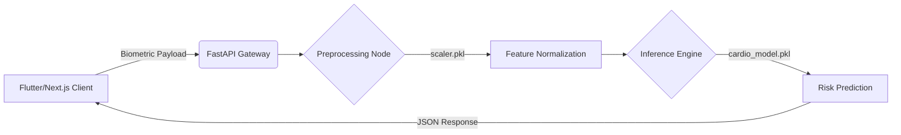

\<div align="center"\>

# 🫀 CARDIO-GUARD BACKEND

### *High-Performance CVD Risk Inference Engine*

[](https://www.google.com/search?q=https://fastapi.tiangolo.com/)
[](https://www.google.com/search?q=https://scikit-learn.org/)
[](https://www.google.com/search?q=https://render.com/)
[](https://www.google.com/search?q=)

**Predicting the future of heart health through deterministic machine learning.**

[Access API Nodes] · [Report Neural Anomaly] · [Project Overview]

\</div\>

-----

## 🌌 Project Vision

The **Cardio-Neural Backend** is a dedicated microservice engineered to bridge raw biometric telemetry with clinical-grade predictive intelligence. Built for the final year CVD Risk Prediction project, this repository handles the heavy lifting of data normalization and algorithmic inference.

-----

## 🛠 Technical Architecture

### 🧠 The Intelligence Layer

The core of this system utilizes serialized intelligence nodes to ensure sub-millisecond prediction latency:

  * **`cardio_model.pkl`**: A pre-trained Random Forest Classifier optimized for high-dimensional biometric patterns.
  * **`scaler.pkl`**: A Standardized Scaling Matrix that ensures input parity with the original training manifold.

### 🔌 Connectivity & Stack

  * **FastAPI**: Asynchronous Python framework for high-concurrency biometric ingestion.
  * **Uvicorn**: ASGI server implementation for lightning-fast request handling.
  * **Scikit-Learn**: The underlying mathematical framework for the inference pipeline.

-----

## 🚀 Deployment Protocol

### 1\. Synchronize Repository

```bash
git clone https://github.com/shakeelscribes/cardiovascluar-backend.git
cd cardiovascluar-backend
```

### 2\. Initialize Neural Environment

```bash
python -m venv env
source env/bin/activate  # Unix/macOS
# OR
.\env\Scripts\activate  # Windows
pip install -r requirements.txt
```

### 3\. Launch Local Instance

```bash
uvicorn main:app --reload --port 8000
```

-----

## 📡 API Interface Map

### **Predict Risk Profile**

`POST /predict`
*Processes biometric vectors and returns a localized risk assessment.*

**Request Payload:**

```json
{
  "age": 23,
  "gender": 1,
  "systolic_bp": 120,
  "diastolic_bp": 80,
  "cholesterol": 1,
  "glucose": 1,
  "smoke": 0,
  "alcohol": 0,
  "active": 1,
  "bmi": 22.5
}
```

**System Response:**

```json
{
  "risk_score": 0.12,
  "classification": "Low Risk",
  "timestamp": "2026-04-19T18:19:55Z"
}
```

-----

## 🏗 System Topology



-----

## 👥 Engineering Collective

This system is maintained and developed by the **Nellai College of Engineering** core team:

  * **Mohamed Shakeel** (Lead Backend Architect)
  * **Shabith Subair**
  * **Sri Thandapani**
  * **Mohamed Imran**

-----

\<div align="center"\>

**[ ⚡ SYSTEM OPERATIONAL ]**
*Designed for the future of preventive cardiology.*

\</div\>